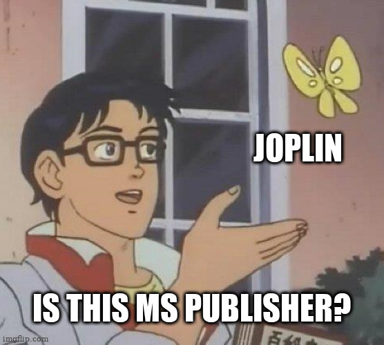

Hello 

This is a post listing few possible use cases for this plugin I've been procrastinating to write for some time, yet here it is. Please note that I'm aware of other approaches and software achieving the same or better result. This post is just a catalogue of ideas how this plugin could be used.

Humorous preamble: Marrying filesystem after years of one night stands

Let's face it, attachments in our notes are out of date. In fact, we know that and don't even care keep them "fresh". We know that editing an attachment in a note is cumbersome and doesn't quite work on mobile. 

We accepted long ago that nothing lasts forever and quietly gave up on long term relationships between our files and notes. They meet regularly, exchange a few nice sentences and go on with their life. 

Each of them has got its own organization and rituals. What can you do if they are so different? 

They've been growing apart for so long and each of them even got a lover. Notes flirt here and there with these pesky website clippings, and filesystem is always chatting with that chad dude calling himself a Cloud (yet we all know that he's just a bit distant douchebag  filesystem). Maybe they just not destined to be together? 

Well, introducing Polygamy! ***cough-cough***, oh, that's not right, um wrong meeting... What the heck... Jeffrey! I asked you to move this talk with my wife to another time! I don't care that she left me! Gosh, those amateurs...

I mean... um... Introducing Resource Replacement! 👏👏👏

With resource replacement we can tie ~~those bastards in the basement~~ filesystem and notes while allowing them to keep independent structure.

# Use cases
> Attachments ain't just files, they are idea illustrations and good ideas are always a subject of evolution

## Claim space back

So far, the main usage of this plugin - to streamline the process of photos quality reduction freeing up space on a cloud storage

It works like that:

- You install the plugin
- You write down the path of the folder in the plugin settings where you will save your new reduced in size files
- You copy your Joplin files in resource directory (`/.config/joplin/resources/`) to the path you wrote in the settings
- You use quality/size reducing tool of your choice to all file in that copied folder. Could be done with images in bulk via RawTherapee or Lightroom
- You click "Replace resources" from tool menu in Joplin
- Done, your new files are now in Joplin and will be synced with the cloud.

The advantages of this method:

- Works in bulk of any size
- Works with any file format
- Once setup you can run it multiple times: periodically (every sync) or until you get the result you need
- There's less risk messing data due to user error

## Above and beyond

[](https://mermaid-js.github.io/mermaid-live-editor/edit#eyJjb2RlIjoiZmxvd2NoYXJ0IFREXG5cdHN1YmdyYXBoIG1vZGVsXG5cdGRiWyhkYXRhYmFzZSldIC0tIHBlcmlvZGljYWwgLS4tPiBkdW1wIC0tPiBwb3N0cHJvY2Vzc2luZyBcblx0ZW5kXG5cblx0c3ViZ3JhcGggSm9wbGluXG5cdHBvc3Rwcm9jZXNzaW5nIC0tIHN5bmN0aGluZyAtLT4gcnIocmVzb3VyY2UgcmVwbGFjZW1lbnQpIC0tLSBhdHRhY2htZW50c1xuXHRwb3N0cHJvY2Vzc2luZyAtLT4gaG90Zm9sZGVyIC0tIG5ldyBub3RlIC0tPiBhdHRhY2htZW50cyBcblx0ZW5kXG5cblx0c3ViZ3JhcGggcHVibGljXG5cdGF0dGFjaG1lbnRzIC0tPiBwdWJsaXNoXG5cdHB1Ymxpc2h7cHVibGlzaGluZyB0byB3aWRlciBhdWRpZW5jZX0gLS0-IHBkZih0byAucGRmKVxuXHRwdWJsaXNoIC0tPiBlbWFpbChzZW5kIGl0IGFzIGVtYWlsKVxuXHRwdWJsaXNoIC0tPiBibG9nKGV4cG9ydCBhcyBibG9nKVxuXHRwdWJsaXNoIC0tPiBkb21haW4oIHBlcnNvbmFsIHdlYnNpdGUpXG5cdGVuZFxuIiwibWVybWFpZCI6IntcbiAgXCJ0aGVtZVwiOiBcImRlZmF1bHRcIlxufSIsInVwZGF0ZUVkaXRvciI6ZmFsc2UsImF1dG9TeW5jIjp0cnVlLCJ1cGRhdGVEaWFncmFtIjpmYWxzZX0)

mermaid source

### Other personal use
Updating attachments in bulk in already existing structure

#### Long standing thumbnail
Keep an updating map of your trips

Bonus:
- have a decorated note of your life milestones
- bring up a seasonal change to your notes with 

#### Portfolio of your work
Create and publish to your domain, test illustrations and work assets for the best result

Bonus:
- Classified advertisement: paste and update the images highlighting specific features of the product
- Tableu exports and rich charts: Update professional charts when data change, keep in depth explanations

#### QR code updates when link changes

#### Technical documentation hosted on GitHub pages
Get inspired to craft rich(er) tech documents with more illustrative or runnable assets. Easily update all the assets in bulk in existing structure when UI, requirements or mood of your boss changes.  Works especially well with git trackers. 

Bonus:
- Article / presentation mockups: create a mockup of the document, split the visualization and text writing work among different people
- Editorial work: split a document by chapters and attach the combined rendered product to every chapter

#### Public event organizer
Announce tickets sold, sits taken, places booked, neighbourhood parking spots available on a rendered printable document

### Advanced use
#### Mobile drawing update
Be able to save updates of your drawing on mobile. Just sync the updated images to the plugin folder.

#### Combined dashboard
Compile a custom dashboard from many different informational sources with page screenshots and script automation

Basic use can include setting up Google docs based workflow: Forms > Spreadsheets > Charts or pivots > publishing a link to image > script to save the image in resource replacement folder

#### Document preview (WIP)
Attach a file preview on save 

### Professional use: intranet projects, open source sharepoint

Discussion board and proposal review (meeting minutes): Multiple pages with a single asset, focusing on different perspectives. 
Bonus: Application architecture review, budget and analysis review

Cafe menu, coffee shop week's special

Placeholder for company policies: Guidelines for quality, corporate style sheet, getting started for new employee

Project overview: Attendance, vacation, project scheduling

Joplin as HR portal: An employee profile linked with other sources of information: payroll database, vacation schedule, permission map, a role in organisational structure and shift charts

Online course catalogue: every note is a lesson. The files are things subjected to change like examples of code executed on live data.

Decks for employee accessible technical documentation: network, vpn configuration, periodical research findings updates

Corporate knowledge base: metadatabase, tables description, actual table dump sample you can preview and query

Reporting landing page: collection of files summarizing a time period

***